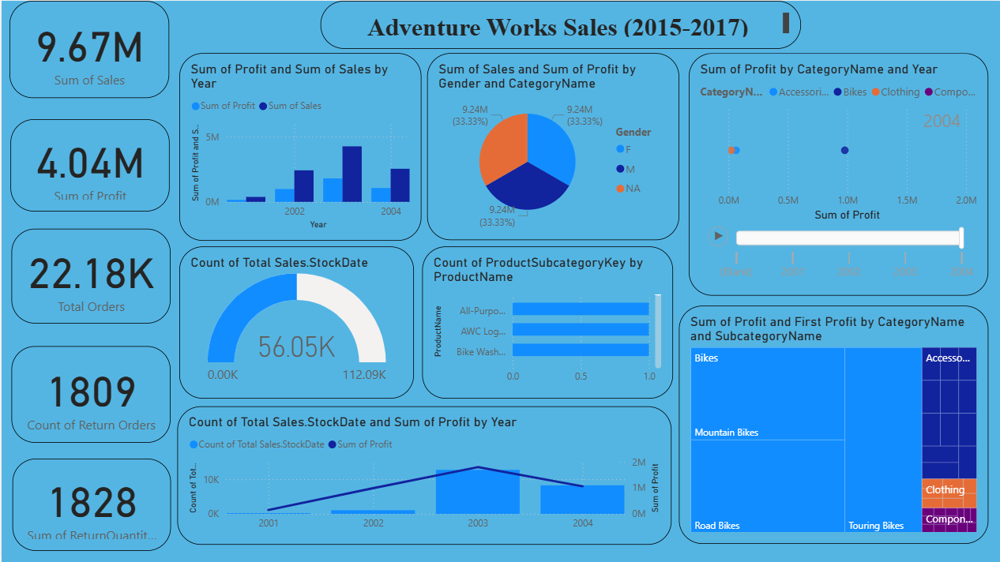

1️⃣ 📊 Adventure Works Sales Analysis Dashboard (2015–2017)

  <b>Power BI Dashboard for Sales, Profit & Product Performance Analysis</b> 
  Revenue • Profit • Orders • Returns • Category Insights

---

2️⃣ 🚀 Project Overview
This project presents an **interactive Power BI Sales Analytics Dashboard** built using the **Adventure Works dataset**, focusing on sales performance, profitability, product categories, customer behavior, and return analysis from **2015 to 2017**.

The dashboard enables stakeholders to track **business growth, identify high-performing categories, and understand profit drivers** using data-driven insights.

---

3️⃣ 🧠 Business Questions Answered
1. What is the **total sales and profit performance**?
2. Which **product categories and subcategories generate the highest profit**?
3. How do **sales and profit trends change year over year**?
4. What is the **order volume and return behavior**?
5. Which **products contribute most to overall sales count**?

---

4️⃣ 📌 Key KPIs
| Metric | Value |
|------|------|
| 💰 Total Sales | **9.67M** |
| 📈 Total Profit | **4.04M** |
| 🛒 Total Orders | **22.18K** |
| 🔄 Return Orders | **1809** |
| 📦 Returned Quantity | **1828** |

---

5️⃣ 📈 Key Insights (Senior Data Analyst View)

5.1 🔹 Sales & Profit Trend  
- Sales and profit show consistent growth over the years.
- Peak performance observed around **2003–2004**, indicating strong business expansion.

5.2 🔹 Category-Level Profit Analysis  
- **Bikes** category dominates total profit contribution.
- **Mountain Bikes** and **Road Bikes** are top-performing subcategories.

5.3 🔹 Gender & Category Distribution  
- Sales and profit distribution across gender categories remains balanced.
- Indicates wide market reach and diversified customer base.

5.4 🔹 Product Performance  
- A limited number of products contribute significantly to total sales.
- Highlights opportunity for inventory and demand optimization.

5.5 🔹 Orders & Returns Analysis  
- Return orders form a small but critical segment.
- Useful for monitoring product quality and customer satisfaction.

---

6️⃣ 🖥 Dashboard Preview
🔗 **Power BI Dashboard Screenshot**

---

7️⃣ 🛠 Tools & Technologies Used
- **Power BI** – Interactive dashboards, DAX measures
- **Microsoft Excel** – Data preparation and preprocessing
- **Data Modeling** – Fact–dimension relationships
- **Sales Analytics Concepts** – Revenue, profit, returns, category analysis

---

7️⃣ 🛠 Tools & Technologies Used
- **Power BI** – Interactive dashboards, DAX measures
- **Microsoft Excel** – Data preparation and preprocessing
- **Data Modeling** – Fact–dimension relationships
- **Sales Analytics Concepts** – Revenue, profit, returns, category analysis

---

🔟 🎯 Business Impact
This dashboard helps organizations to:
- Track revenue and profit growth
- Identify high-margin product categories
- Improve product and inventory strategy
- Monitor return behavior
- Support executive-level sales decisions

--

1️⃣1️⃣ 👤 Author
**Praveen Tiwari**  
Aspiring Data Analyst | Power BI | Excel | Data Analytics  

